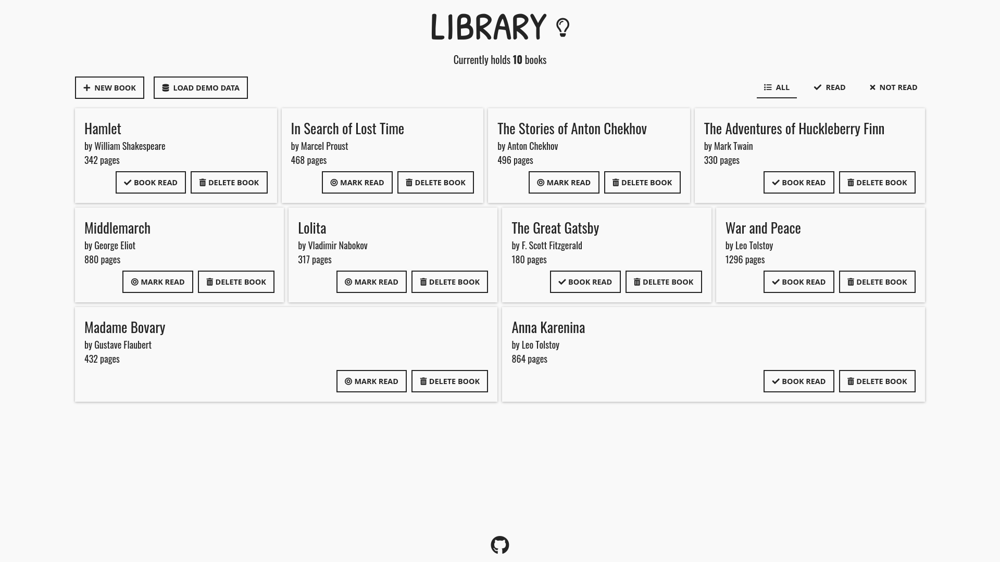
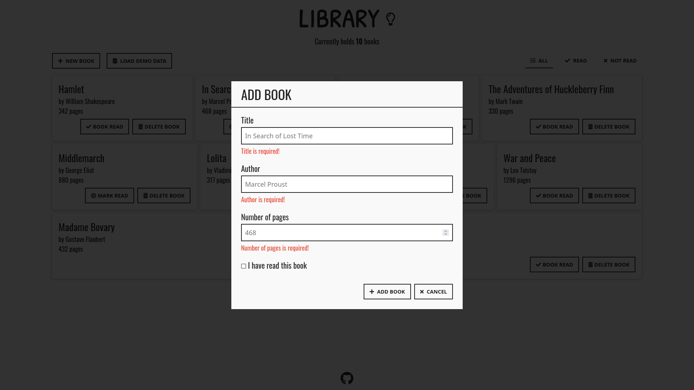
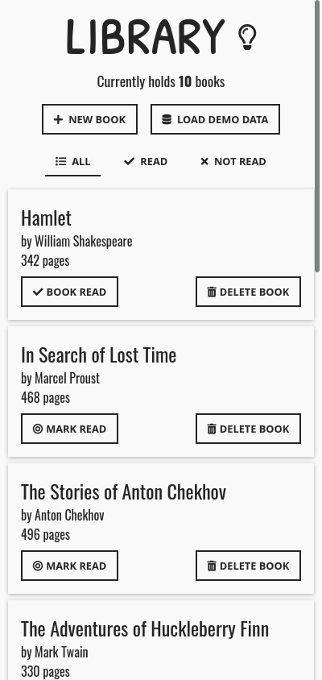
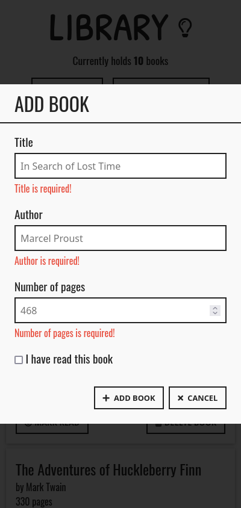

# Library - Odin project
Book Library implemented in JavaScript with a simple graphical user interface. This project was an assignment from [Odin's Full Stack JavaScript path](https://www.theodinproject.com/paths/full-stack-javascript/courses/javascript/lessons/library).

## Screenshots

### Desktop

### Mobile

## Demo

